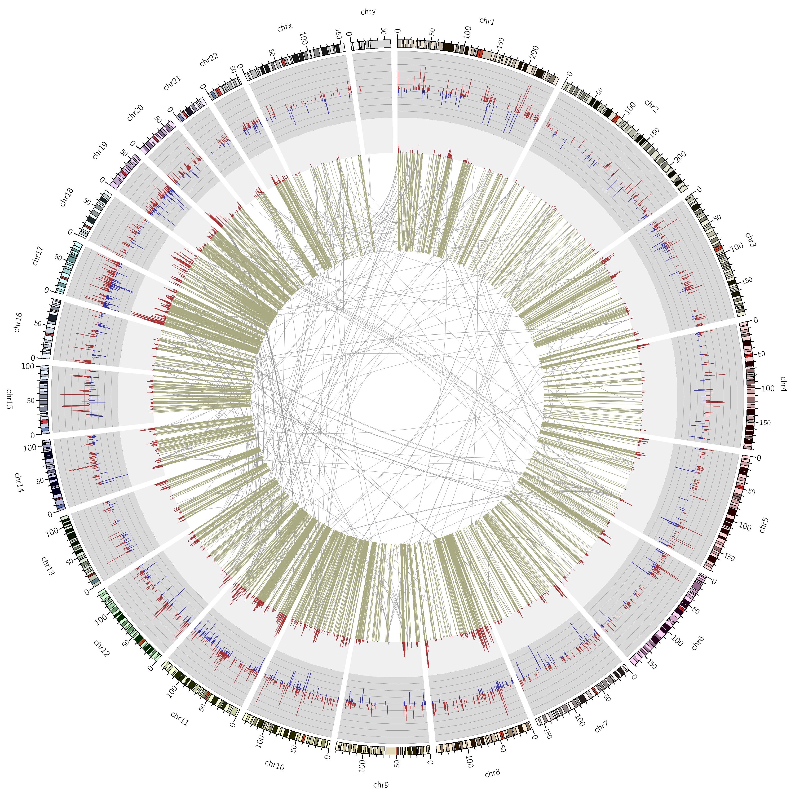
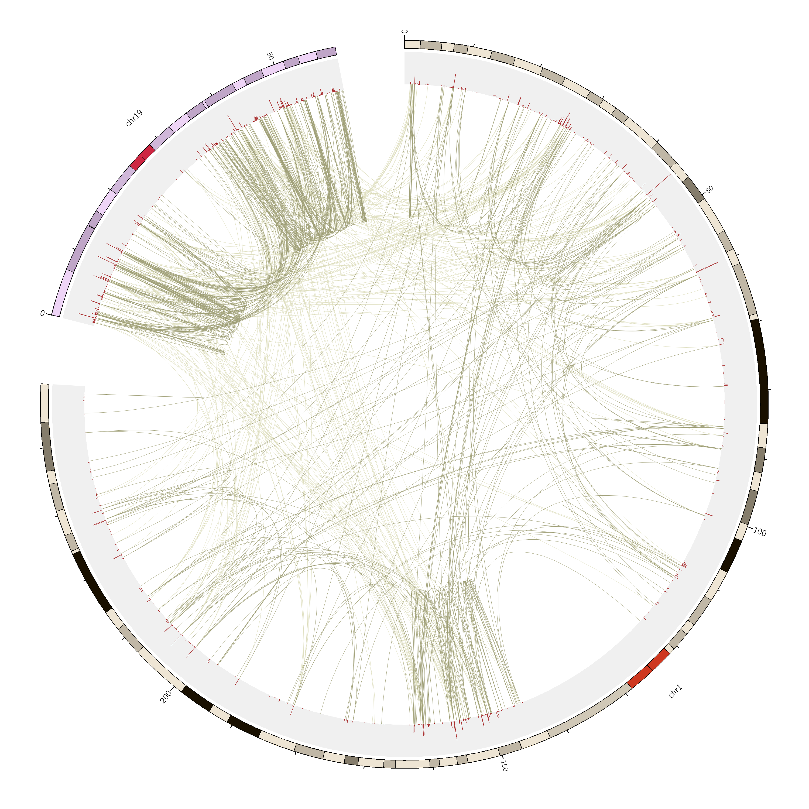
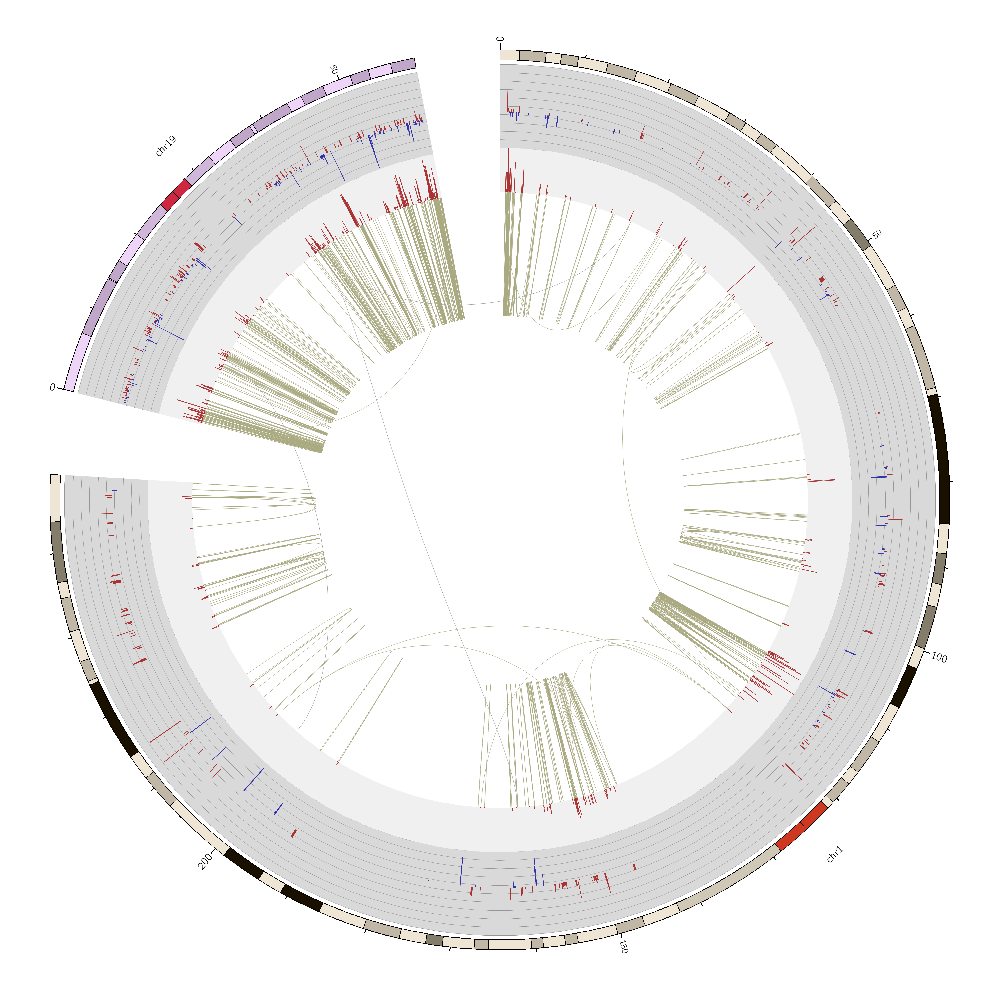

# RNASeq interactions from TCGA BRCA samples

A nice observation: RNAseq interactions on healthy tissue are mostly
interchromosomic, whereas in tumor tissue they are mostly
intrachromosomic.

           | healthy | tumor
-----------|---------|------
same chrom | 1473    | 11040
diff chrom | 9801    | 266

<table>
<tr>
<td>A. Healthy tissue</td>
<td>B. Tumor tissue</td>
</tr>
<tr>
<td>C. Healthy tissue, zoomed into chrs 1 and 19</td>
<td>D. Tumor tissue, zoomed into chrs 1 and 19</td>
</tr>
</table>

Shown in red in all plots are the node degrees in the interaction network. Tumor plots also show differential expression profiles in the outermost ring. 
